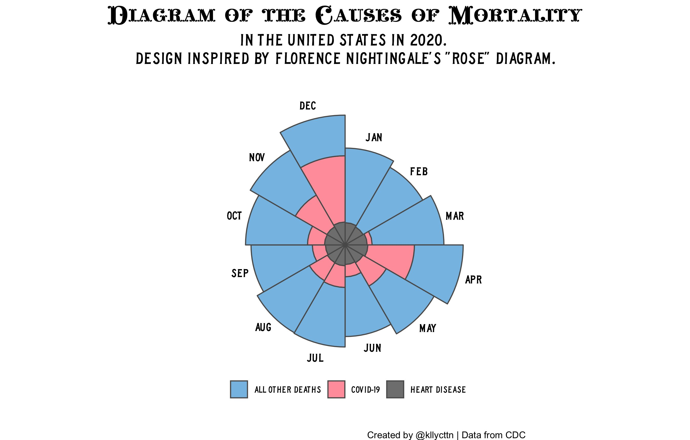

# 30DayChartChallenge 2021: *#rstats edition*

*A list of charts created for #30DayChartChallenge using #rstats*.
To learn more about #30DayChartChallenge visit the [GitHub repository](https://github.com/Z3tt/30DayChartChallenge_2021) or our [Twitter account](https://twitter.com/30DayChartChall).

## How to contribute?

Anyone is welcome to contribute.
Feel free to create a pull request with a link to your chart and code (optional). 

## Table of content

|                            |                         |                            |                             |                           |
|----------------------------|-------------------------|----------------------------|-----------------------------|---------------------------|
| [01 part-to-whole](#day-1) | [07 physical](#day-7)   | [13 correlation](#day-13)  | [19 global change](#day-19) | [25 demographic](#day-25) |
| [02 pictogram](#day-2)     | [08 animals](#day-8)    | [14 space](#day-14)        | [20 upwards](#day-20)       | [26 trends](#day-26)      |
| [03 historical](#day-3)    | [09 statistics](#day-9) | [15 multivariate](#day-15) | [21 downwards](#day-21)     | [27 educational](#day-27) |
| [04 magical](#day-4)       | [10 abstract](#day-10)  | [16 trees](#day-16)        | [22 animation](#day-22)     | [28 future](#day-28)      |
| [05 slope](#day-5)         | [11 circular](#day-11)  | [17 pop culture](#day-17)  | [23 tiles](#day-23)         | [29 deviations](#day-29)  |
| [06 experimental](#day-6)  | [12 strips](#day-12)    | [18 connections](#day-18)  | [24 monochrome](#day-24)    | [30 3D](#day-30)          |

# comparisons

## Day 1 

2021-04-01 | part-to-whole

- [kllycttn](https://twitter.com/kllycttn) - [link](https://twitter.com/kllycttn/status/1377731024105443337) - [code](https://t.co/bNPOpynnvE?amp=1)
- [MarcosFontela](https://twitter.com/MarcosFontela) - [link](https://twitter.com/MarcosFontela/status/1377751255393665031)
- [kaiz_p](https://twitter.com/kaiz_p) - [link](https://twitter.com/kaiz_p/status/1377800217576153089) - [code](https://t.co/gWI03CSz3o?amp=1)
- [willshDev](https://twitter.com/willshDev) - [link](https://twitter.com/willshDev/status/1377813865455513601) - [code](https://t.co/Azfd2RyrnE?amp=1)
- [dr_xeo](https://twitter.com/dr_xeo) - [link](https://twitter.com/dr_xeo/status/1377532593248276481?s=20) - [code](https://github.com/dominicroye/30DayChartChallenge2021_code)
- [marcin_stepniak](https://twitter.com/marcin_stepniak) - [link](https://twitter.com/marcin_stepniak/status/1377752694102880262) - [code](https://t.co/JDAnAfMM4X?amp=1)
- [NearandDistant](https://twitter.com/NearandDistant) - [link](https://twitter.com/NearandDistant/status/1377755490210447361) - [code](https://t.co/RjAlQwuzZZ?amp=1)
- [jakekaupp](https://twitter.com/jakekaupp) - [link](https://twitter.com/jakekaupp/status/1377684168314867721) - [code](https://t.co/H0RsYGnw5E?amp=1)
- [MaiaPelletier](https://twitter.com/MaiaPelletier) - [link](https://twitter.com/MaiaPelletier/status/1377697152433016833) - [code](https://t.co/KjTUCnO3Xb?amp=1)
- [cnicault](https://twitter.com/cnicault) - [link](https://twitter.com/cnicault/status/1377690522815500290) - [code](https://t.co/PzP8s1Z9VX?amp=1)
- [loreabad6](https://twitter.com/loreabad6) - [link](https://twitter.com/loreabad6/status/1377671473545027585) - [code](https://t.co/xd5LqM2cWO?amp=1)
- [drtimschoof](https://twitter.com/drtimschoof) - [link](https://twitter.com/drtimschoof/status/1377630408964202498) - [code](https://t.co/wn4W8yqyfj?amp=1)
- [InfometricsNZ](https://twitter.com/InfometricsNZ) - [link](https://twitter.com/InfometricsNZ/status/1377480555025981443) 
- [JanPhilippKolb](https://twitter.com/JanPhilippKolb) - [link](https://twitter.com/JanPhilippKolb/status/1377528165573218306)
- [li_bennett_](https://twitter.com/li_bennett_) - [link](https://twitter.com/li_bennett_/status/1377545123366572037) - [code](https://t.co/Aqnw6Yw6Fr?amp=1)
- [Amit_Levinson](https://twitter.com/Amit_Levinson) - [link](https://twitter.com/Amit_Levinson/status/1377555868821114881) - [code](https://t.co/LbqJtLGohU?amp=1)
- [sharlagelfand](https://twitter.com/sharlagelfand) - [link](https://twitter.com/sharlagelfand/status/1377633719524204555) - [code](https://t.co/G6RJSLmokP?amp=1)
- [elartedeldato](https://twitter.com/elartedeldato) - [link](https://twitter.com/elartedeldato/status/1377663767220256770)
- [rppfeiffer](https://twitter.com/rppfeiffer) - [link](https://twitter.com/rppfeiffer/status/1377839573145956352) - [code](https://t.co/QJoRfItbu2?amp=1)
- [danoehm](https://twitter.com/danoehm) - [link](https://twitter.com/danoehm/status/1377863587754954756)
- [cararthompson](https://twitter.com/cararthompson) - [link](https://twitter.com/cararthompson/status/1377664146666315781) - [code](https://github.com/cararthompson/30DayChartChallenge/)
- [ikashnitsky](https://twitter.com/ikashnitsky) - [link](https://twitter.com/ikashnitsky/status/1377641808998625280) - [code](https://github.com/ikashnitsky/30DayChartChallenge)
- [Rami_Krispin](https://twitter.com/Rami_Krispin) - [link](https://twitter.com/Rami_Krispin/status/1377658556095160325) - [code](https://github.com/RamiKrispin/30DayChartChallenge/tree/main/day1)
- [fgazzelloni](https://twitter.com/fgazzelloni) - [link](https://twitter.com/FGazzelloni/status/1378224536123011072) - [code](https://github.com/Fgazzelloni/TidyTuesday/blob/main/w14/The_pudding_w14.Rmd)
- [Muhammad Aswan Syahputra](https://twitter.com/aswansyahputra_) - [link](https://twitter.com/aswansyahputra_/status/1377822611464355851) - [code](https://github.com/aswansyahputra/30daychartchallenge/blob/master/01-part_to_whole.R)

## Day 2 

2021-04-02 | pictogram

- [elartedeldato](https://twitter.com/elartedeldato) - [link](https://twitter.com/elartedeldato/status/1377887462714933251)
- [Amit_Levinson](https://twitter.com/Amit_Levinson) - [link](https://twitter.com/Amit_Levinson/status/1377958980018900993) - [code](https://t.co/XyoSjUmKVe?amp=1)
- [kllycttn](https://twitter.com/kllycttn) - [link](https://twitter.com/kllycttn/status/1377977958539751427) - [code](https://t.co/WbmzMhBFPN?amp=1)
- [loreabad6](https://twitter.com/loreabad6) - [link](https://twitter.com/loreabad6/status/1377986635917258757) - [code](https://t.co/Ux5pfJ2mpn?amp=1)
- [sarahe145](https://twitter.com/sarahe145) - [link](https://twitter.com/sarahe145/status/1378101238772998151) - [code](https://t.co/qfqqHeDDNQ?amp=1)
- [MBozukova](https://twitter.com/MBozukova) - [link](https://twitter.com/MBozukova/status/1378045452822646788)
- [danoehm](https://twitter.com/danoehm) - [link](https://twitter.com/danoehm/status/1378253914697461760) - [code](https://t.co/BdHsViSgnw?amp=1)
- [aswansyahputra_](https://twitter.com/aswansyahputra_) - [link](https://twitter.com/aswansyahputra_/status/1378322820199936001) - [code](https://t.co/BwpMRzaLZB?amp=1)
- [sianbladon](https://twitter.com/sianbladon) - [link](https://twitter.com/sianbladon/status/1378041698174001153) - [code](https://t.co/y8NQkj702I?amp=1)
- [cnicault](https://twitter.com/cnicault) - [link](https://twitter.com/cnicault/status/1378061757705519104) - [code](https://t.co/PzP8s1Z9VX?amp=1)
- [kaiz_p](https://twitter.com/kaiz_p) [link](https://twitter.com/kaiz_p/status/1378164343880122368) - [code](https://t.co/TRLwCrfw1o?amp=1)
- [tessuheagle](https://twitter.com/tessuheagle) - [link](https://twitter.com/tessuheagle/status/1378077397430329344) - [code](https://t.co/eQMgvjIYOE?amp=1)
- [kustav_sen](https://twitter.com/kustav_sen) - [link](https://twitter.com/kustav_sen/status/1378366923092631561) - [code](https://t.co/GMaazUy4k1?amp=1)
- [jakekaupp](https://twitter.com/jakekaupp) - [link](https://twitter.com/jakekaupp/status/1378080685383114755) [code](https://t.co/H0RsYGnw5E?amp=1)
- [dr_xeo](https://twitter.com/dr_xeo) - [link](https://twitter.com/dr_xeo/status/1377891912099713031)
- [fgazzelloni](https://twitter.com/FGazzelloni) - [link](https://twitter.com/FGazzelloni/status/1378514839593746436) - [code](https://github.com/Fgazzelloni/rstats-chart-challenge-2021/blob/main/day2_pictogram/covid19_icu.R)
- [Rami_Krispin](https://twitter.com/Rami_Krispin) - [link](https://twitter.com/Rami_Krispin/status/1378061546375368704) - [code](https://github.com/RamiKrispin/30DayChartChallenge/tree/main/day2)
- [Muhammad Aswan Syahputra](https://twitter.com/aswansyahputra_) - [link](https://twitter.com/aswansyahputra_/status/1378322820199936001) - [code](https://github.com/aswansyahputra/30daychartchallenge/blob/master/02-pictogram.R)

## Day 3 

2021-04-03 | historical

- [MBozukova](https://twitter.com/MBozukova) - [link](https://twitter.com/MBozukova/status/1378401998983335941)
- [kaiz_p](https://twitter.com/kaiz_p) - [link](https://twitter.com/kaiz_p/status/1378514233906753539) - [code](https://t.co/KgluDLv4n4?amp=1)
- [loreabad6](https://twitter.com/loreabad6) - [link](https://twitter.com/loreabad6/status/1378456893765615620) - [code](https://t.co/323sifhI2z?amp=1)
- [marcin_stepniak](https://twitter.com/marcin_stepniak) - [link](https://twitter.com/marcin_stepniak/status/1378414980085784580) - [code](https://t.co/84QlxO1CRJ?amp=1)
- [j_marlier](https://twitter.com/j_marlier) - [link](https://twitter.com/j_marlier/status/1378437771212288008) - [code](https://t.co/at0QyGcOqO?amp=1)
- [CSHoggard](https://twitter.com/CSHoggard) - [link](https://twitter.com/CSHoggard/status/1378464065702535170?s=20) - [code](https://t.co/6qafWL7n4B?amp=1)
- [kllycttn](https://twitter.com/kllycttn) - [link](https://twitter.com/kllycttn/status/1378403349628866568) - [code](https://t.co/jdPUvDgF8Q?amp=1)
- [ijeamaka_a](https://twitter.com/ijeamaka_a) - [link](https://twitter.com/ijeamaka_a/status/1378437873137905665) - [code](https://t.co/8iEmbXYyXc?amp=1)
- [geokaramanis](https://twitter.com/geokaramanis) - [link](https://twitter.com/geokaramanis/status/1378432185917661187) - [code](https://t.co/CIjXlHV1PR?amp=1)
- [cnicault](https://twitter.com/cnicault) - [link](https://twitter.com/cnicault/status/1378673876171907076) - [code](https://t.co/PzP8s1Z9VX?amp=1)
- [elartedeldato](https://twitter.com/elartedeldato) - [link](https://twitter.com/elartedeldato/status/1378288348612165634)
- [USGS_DataSci](https://twitter.com/USGS_DataSci) - [link](https://twitter.com/USGS_DataSci/status/1378351609239994374)
- [dr_xeo](https://twitter.com/dr_xeo) - [link](https://twitter.com/dr_xeo/status/1378255283143766020)
- [ikashnitsky](https://twitter.com/ikashnitsky) - [link](https://twitter.com/ikashnitsky/status/1378251035144245250) - [code](https://github.com/OxfordDemSci/ex2020)
- [CedScherer](https://twitter.com/CedScherer) - [link](https://twitter.com/CedScherer/status/1378332574876061700) - [code](https://github.com/Z3tt/30DayChartChallenge/blob/main/03_historical/03_historical.R)
- [Rami_Krispin](https://twitter.com/Rami_Krispin) - [link](https://twitter.com/Rami_Krispin/status/1378325144930643973) - [code](https://github.com/RamiKrispin/30DayChartChallenge/tree/main/day3)
- [fgazzelloni](https://twitter.com/FGazzelloni) - [link](https://twitter.com/FGazzelloni/status/1378862160894427138) - [code](https://github.com/Fgazzelloni/rstats-chart-challenge-2021/blob/main/day3_historical/map_dataViz.R)
- [Muhammad Aswan Syahputra](https://twitter.com/aswansyahputra_) - [link](https://twitter.com/aswansyahputra_/status/1379078394705440770) - [code](https://github.com/aswansyahputra/30daychartchallenge/blob/master/03-historical.R)

## Day 4 

2021-04-04 | magical

- [tessuheagle](https://twitter.com/tessuheagle) - [link](https://twitter.com/tessuheagle/status/1378858272917086214?s=20) - [ijeamaka_a](https://twitter.com/ijeamaka_a) - [link](https://twitter.com/ijeamaka_a/status/1378765143023046658?s=20) - [code](https://t.co/7XS45iwHYA?amp=1)
- [kllycttn](https://twitter.com/kllycttn)  - [link](https://twitter.com/kllycttn/status/1378758942650728449?s=20) - [code](https://t.co/jhBdHF9SIQ?amp=1)
- [francisko_r](https://twitter.com/francisko_r) - [link](https://twitter.com/francisko_r/status/1378734767965888515?s=20) - [code](https://t.co/D5woJJppll?amp=1)
- [kustav_sen](https://twitter.com/kustav_sen) - [link](https://twitter.com/kustav_sen/status/1378636480877264899) - [code](https://t.co/xzPBSQKOmc?amp=1)
- [dr_xeo](https://twitter.com/dr_xeo) - [link](https://twitter.com/dr_xeo/status/1378624024549453825)
- [elartedeldato](https://twitter.com/elartedeldato) - [link](https://twitter.com/elartedeldato/status/1378620604291588100)
- [GaryLynch94](https://twitter.com/GaryLynch94) - [link](https://twitter.com/GaryLynch94/status/1378693652273377280)
- [CedScherer](https://twitter.com/CedScherer) - [link](https://twitter.com/CedScherer/status/1378766149811322885) - [code](https://github.com/Z3tt/30DayChartChallenge/blob/main/04_magical/04_magical.R)
- [ikashnitsky](https://twitter.com/ikashnitsky) - [link](https://twitter.com/ikashnitsky/status/1378673154730647555) - [code](https://github.com/ikashnitsky/30DayChartChallenge/blob/main/scr/04-magic.R)
- [Rami_Krispin](https://twitter.com/Rami_Krispin) - [link](https://twitter.com/Rami_Krispin/status/1378693915629383682) - [code](https://github.com/RamiKrispin/30DayChartChallenge/tree/main/day4)
- [fgazzelloni](https://twitter.com/FGazzelloni) - [link](https://twitter.com/FGazzelloni/status/1379468063523897347) - [code](https://github.com/Fgazzelloni/rstats-chart-challenge-2021/blob/main/day4_magical/day4.R)
- [Muhammad Aswan Syahputra](https://twitter.com/aswansyahputra_) - [link](https://twitter.com/aswansyahputra_/status/1379479247056642065) - [code](https://github.com/aswansyahputra/30daychartchallenge/blob/master/04-magical.R)

## Day 5

2021-04-05 | slope

- [dr_xeo](https://twitter.com/dr_xeo) - [link](https://twitter.com/dr_xeo/status/1378997788248317955?s=20)
- [elartedeldato](https://twitter.com/elartedeldato) - [link](https://twitter.com/elartedeldato/status/1378974687292624897?s=20)
- [geokaramanis](https://twitter.com/geokaramanis) - [link](https://twitter.com/geokaramanis/status/1378933521583120390?s=20) - [code](https://t.co/CIjXlHV1PR?amp=1)
- [ikashnitsky](https://twitter.com/ikashnitsky) - [link](https://twitter.com/ikashnitsky/status/1379025851317161985) - [code](https://github.com/ikashnitsky/30DayChartChallenge/blob/main/scr/05-slope-best-life-expectancy.R)
- [CedScherer](https://twitter.com/CedScherer) - [link](https://twitter.com/i/timeline) - [code](https://github.com/Z3tt/30DayChartChallenge/blob/main/05_slope/05_slope.R)
- [kllycttn](https://twitter.com/kllycttn) - [link](https://twitter.com/kllycttn/status/1379030480658518026) - [code](https://t.co/G0WaWEgrI0?amp=1)
- [Rami_Krispin](https://twitter.com/Rami_Krispin) - [link](https://twitter.com/Rami_Krispin/status/1378325144930643973) - [code](https://github.com/RamiKrispin/30DayChartChallenge/tree/main/day5)
- [ijeamaka_a](https://twitter.com/ijeamaka_a) - [link](https://twitter.com/ijeamaka_a/status/1379101904823676931?s=20) - [code](https://t.co/lJZ5rAuJge?amp=1)
- [emilmalta](https://twitter.com/emilmalta) - [link](https://twitter.com/emilmalta/status/1379908748475514886?s=20) - [code](https://t.co/GH59KonPEJ?amp=1)
- [cnicault](https://twitter.com/cnicault) - [link](https://twitter.com/cnicault/status/1379079892457943048?s=20) - [code](https://t.co/YzIkqPiebi?amp=1)
- [Amit_Levinson](https://twitter.com/Amit_Levinson) - [link](https://twitter.com/Amit_Levinson/status/1379172884367691779?s=20) - [code](https://t.co/TY6gnAxsSV?amp=1)
- [fgazzelloni](https://twitter.com/FGazzelloni) - [link](https://twitter.com/FGazzelloni/status/1379745725752471552) - [code](https://github.com/Fgazzelloni/TidyTuesday/blob/main/w15/w15_forest_fire.R)
- [Muhammad Aswan Syahputra](https://twitter.com/aswansyahputra_) - [link](https://twitter.com/aswansyahputra_/status/1381110406194728961) - [code](https://github.com/aswansyahputra/30daychartchallenge/blob/master/05-slope.R)

## Day 6

2021-04-06 | experimental

- [ikashnitsky](https://twitter.com/ikashnitsky) - [link](https://twitter.com/ikashnitsky/status/1379316226267156481) - [code](https://github.com/ikashnitsky/30DayChartChallenge/blob/main/scr/06-experiment.R)
- [kllycttn](https://twitter.com/kllycttn) - [link](https://twitter.com/kllycttn/status/1379461958668279809) - [code](https://t.co/d6yYwbW1NG?amp=1)
- [Rami_Krispin](https://twitter.com/Rami_Krispin) - [link](https://twitter.com/Rami_Krispin/status/1379797036837470208) - [code](https://github.com/RamiKrispin/30DayChartChallenge/tree/main/day6)
- [jakekaup](https://twitter.com/jakekaupp) - [link](https://twitter.com/jakekaupp/status/1379606812849270784?s=20) - [code](https://t.co/1BhlhPnYyC?amp=1)
- [desuc](https://twitter.com/desuc_) - [link](https://twitter.com/desuc_/status/1379624655074512896?s=20)
- [claudiodanielpc](https://twitter.com/claudiodanielpc) - [link](https://twitter.com/claudiodanielpc/status/1379505105255419917?s=20) - [code](https://t.co/ZIG2khrSpq?amp=1)
- [emilmalta](https://twitter.com/emilmalta) - [link](https://twitter.com/emilmalta/status/1380278376661983232?s=20) - [code](https://t.co/uqAJqvjuXi?amp=1)
- [AndyBridger](https://twitter.com/AndyBridger) - [link](https://twitter.com/AndyBridger/status/1380415182128615426?s=20) - [code](https://t.co/QT83LxBU06?amp=1)
- [elartedeldato](https://twitter.com/elartedeldato) - [link](https://twitter.com/elartedeldato/status/1379333803655618561?s=20)
- [JuliaMuellerFr](https://twitter.com/JuliaMuellerFr) - [link](https://twitter.com/JuliaMuellerFr/status/1379528721086971908?s=20)
- [ijeamaka_a](https://twitter.com/ijeamaka_a) - [link](https://twitter.com/ijeamaka_a/status/1379493271806771203?s=20) - [code](https://t.co/SeS4c2oU9V?amp=1)
- [CedScherer](https://twitter.com/CedScherer) - [link](https://twitter.com/CedScherer/status/1379493675684786185?s=20) - [code](https://t.co/mC4egFicAk?amp=1)
- [fgazzelloni](https://twitter.com/FGazzelloni) - [link](https://twitter.com/FGazzelloni/status/1380108357458083843) - [code](https://github.com/Fgazzelloni/rstats-chart-challenge-2021/blob/main/day6_experimental/experiment.R)
- [Muhammad Aswan Syahputra](https://twitter.com/aswansyahputra_) - [link](https://twitter.com/aswansyahputra_/status/1381476055081349123) - [code](https://github.com/aswansyahputra/30daychartchallenge/blob/master/06-experimental.R)

# distributions

## Day 7 

2021-04-07 | physical

- [ingrid_zoll](https://twitter.com/ingrid_zoll) - [link](https://twitter.com/ingrid_zoll/status/1379961069670526985?s=20) - [code](https://t.co/GuAZ1MecjP?amp=1)
- [quite_grey](https://twitter.com/quite_grey) - [link](https://twitter.com/quite_grey/status/1379742590501847041?s=20) - 
- [elartedeldato](https://twitter.com/elartedeldato) - [link](https://twitter.com/elartedeldato/status/1379696946466549760?s=20)
- [MaiaPelletier](https://twitter.com/MaiaPelletier) - [link](https://twitter.com/MaiaPelletier/status/1379969094745743360?s=20) - [code](https://t.co/Mva9yiZerH?amp=1)
- [ijeamaka_a](https://twitter.com/ijeamaka_a) - [link](https://twitter.com/ijeamaka_a/status/1379990234054545414?s=20) - [code](https://t.co/B47VWPM67k?amp=1)
- [kllycttn](https://twitter.com/kllycttn) - [link](https://twitter.com/kllycttn/status/1379906267813122048?s=20) - [code](https://t.co/5dnMAMWNpE?amp=1)
- [JuliaMuellerFr](https://twitter.com/JuliaMuellerFr) - [link](https://twitter.com/JuliaMuellerFr/status/1380094972540694528?s=20) - [code](https://t.co/3ztlYBV2tw?amp=1)
- [cnicault](https://twitter.com/cnicault) - [link](https://twitter.com/cnicault/status/1380258965964124169?s=20) - [code](https://t.co/YzIkqPiebi?amp=1)
- [dr_xeo](https://twitter.com/dr_xeo) - [link](https://twitter.com/dr_xeo/status/1379720071233351680?s=20)
- [kllycttn](https://twitter.com/kllycttn) - [link](https://twitter.com/kllycttn/status/1379906267813122048) - [code](https://t.co/5dnMAMWNpE?amp=1)
- [Rami_Krispin](https://twitter.com/Rami_Krispin) - [link](https://twitter.com/Rami_Krispin/status/1380193838359191552) - [code](https://github.com/RamiKrispin/30DayChartChallenge/tree/main/day7)
- [marcin_stepniak](https://twitter.com/marcin_stepniak) - [link](https://twitter.com/marcin_stepniak/status/1379914929654919178?s=20) [code](https://t.co/DxD5APUUro?amp=1)
- [fgazzelloni](https://twitter.com/FGazzelloni) - [link](https://twitter.com/FGazzelloni/status/1380299887078694913) - [code](https://github.com/Fgazzelloni/rstats-chart-challenge-2021/blob/main/day7_physics/phisycs_day7.R)

## Day 8 

2021-04-08 | animals

- [li_bennett_](https://twitter.com/li_bennett_) - [link](https://twitter.com/li_bennett_/status/1380087241062682628?s=20) - [code](https://t.co/MYUGHW7Otw?amp=1)
- [sianbladon](https://twitter.com/sianbladon) - [link](https://twitter.com/sianbladon/status/1380091653218840577?s=20) - [code](https://t.co/oVfTfNJBXL?amp=1)
- [cararthompson](https://twitter.com/cararthompson) - [link](https://twitter.com/cararthompson/status/1380135260667662337?s=20) - [code](https://t.co/niAVpmJCRY?amp=1)
- [kllycttn](https://twitter.com/kllycttn) - [link](https://twitter.com/kllycttn/status/1380180239733641223?s=20) - [code](https://t.co/txFZYVOLIg?amp=1)
- [MBozukova](https://twitter.com/MBozukova) - [link](https://twitter.com/MBozukova/status/1380229786149216256?s=20)
- [drtimschoof](https://twitter.com/drtimschoof) - [link](https://twitter.com/drtimschoof/status/1380211403815055368?s=20) - [code](https://t.co/ewylZn79TS?amp=1)
- [Rami_Krispin](https://twitter.com/Rami_Krispin) - [link](https://twitter.com/Rami_Krispin/status/1380278153524875264?s=20) - [code](https://t.co/GaSzOTMbjd?amp=1)
- [geokaramaanis](https://twitter.com/geokaramanis) - [link](https://twitter.com/geokaramanis/status/1380246983886188551?s=20) - [code](https://t.co/HNQp92tVWd?amp=1)
- [elartedeldato](https://twitter.com/elartedeldato) - [link](https://twitter.com/elartedeldato/status/1380064181437759489?s=20)
- [kllycttn](https://twitter.com/kllycttn) - [link](https://twitter.com/kllycttn/status/1380180239733641223) - [code](https://t.co/txFZYVOLIg?amp=1)
- [Rami_Krispin](https://twitter.com/Rami_Krispin) - [link](https://twitter.com/Rami_Krispin/status/1380278153524875264) - [code](https://github.com/RamiKrispin/30DayChartChallenge/tree/main/day8)
- [dr_xeo](https://twitter.com/dr_xeo) - [link](https://twitter.com/dr_xeo/status/1380184219046019072?s=20)
- [fgazzelloni](https://twitter.com/FGazzelloni) - [link](https://twitter.com/FGazzelloni/status/1380301094077620225) - [code](https://github.com/Fgazzelloni/rstats-chart-challenge-2021/blob/main/day8_animals/Animals_day8.R)

## Day 9

2021-04-09 | statistics

- [botanagin](https://twitter.com/botanagin) - [link](https://twitter.com/botanagin/status/1381252632354897923) - [code](https://t.co/tYKX0U7sp4?amp=1)
- [fgazzelloni](https://twitter.com/FGazzelloni) - [link](https://twitter.com/FGazzelloni/status/1380635599183478785) - [code](https://github.com/Fgazzelloni/rstats-chart-challenge-2021/blob/main/day9_statistics/Statistics_day9.R)
- [nicolemark](https://twitter.com/nicolemark_) - [link](https://twitter.com/nicolemark_/status/1381463327293988866?s=20) - [code](https://t.co/P637LiP8mY?amp=1)
- [netra1128](https://twitter.com/netra1128) - [link](https://twitter.com/netra1128/status/1381370963959316486?s=20) - [code](https://t.co/YlASetRffu?amp=1)
- [emilmalta](https://twitter.com/emilmalta) - [link](https://twitter.com/emilmalta/status/1380903445524328454?s=20) - [code](https://t.co/Y6qyougmSz?amp=1)
- [kustav_sen](https://twitter.com/kustav_sen) - [link](https://twitter.com/kustav_sen/status/1380913483269562377?s=20) - [code](https://t.co/Yj6ljJukIb?amp=1)
- [a_bagaini](https://twitter.com/a_bagaini) - [link](https://twitter.com/a_bagaini/status/1381723458493644804?s=20) - [code](https://t.co/gfgKpPyXcF?amp=1)
- [elartedeldato](https://twitter.com/elartedeldato) - [link](https://twitter.com/elartedeldato/status/1380418702303170566?s=20)
- [jieamaka_a](https://twitter.com/ijeamaka_a) - [link](https://twitter.com/ijeamaka_a/status/1379990234054545414?s=20) - [code](https://t.co/B47VWPM67k?amp=1)
- [mbozukova](https://twitter.com/MBozukova) - [link](https://twitter.com/MBozukova/status/1380609669555752965?s=20)
- [marcin_stepniak](https://twitter.com/marcin_stepniak) - [link](https://twitter.com/marcin_stepniak/status/1380656315446464512?s=20) - [code](https://t.co/dV6xFtLc5D?amp=1)
- [rami_krispin](https://twitter.com/Rami_Krispin) - [link](https://twitter.com/Rami_Krispin/status/1380917158146797569?s=20) - [code](https://t.co/TGDUGabKcv?amp=1)

## Day 10

2021-04-10 | abstract

- [fgazzelloni](https://twitter.com/FGazzelloni) - [link](https://twitter.com/FGazzelloni/status/1380963907657941000) - [code](https://github.com/Fgazzelloni/rstats-chart-challenge-2021/blob/main/day10_abstract/Abstract_day10.R)
- [geokaramanis](https://twitter.com/geokaramanis) - [link](https://twitter.com/geokaramanis/status/1380944347391266818) - [code](https://t.co/HNQp92tVWd?amp=1)
- [a_bagaini](https://twitter.com/a_bagaini) - [link](https://twitter.com/a_bagaini/status/1382238693046489090?s=20) - [code](https://t.co/uGKB7MB99p?amp=1)
- [cnicault](https://twitter.com/cnicault) - [link](https://twitter.com/cnicault/status/1382000990031912963?s=20) - [code](https://t.co/rreDw67KAw?amp=1)
- [dosullivan019](https://twitter.com/dosullivan019) - [link](https://twitter.com/dosullivan019/status/1381433252200599554?s=20) - [code](https://t.co/kv661b3fOE?amp=1)
- [ingrid_zoll](https://twitter.com/ingrid_zoll) - [link](https://twitter.com/ingrid_zoll/status/1381393377837522944?s=20) - [code](https://t.co/D48iJSvcaw?amp=1)
- [ikashnitsky](https://twitter.com/ikashnitsky) - [link](https://twitter.com/ikashnitsky/status/1381356371657039874?s=20) - [code](https://t.co/ohAJL3kXJq?amp=1)
- [m_cnakhaee](https://twitter.com/m_cnakhaee) - [link](https://twitter.com/m_cnakhaee/status/1381306499989917700?s=20) - [code](https://t.co/kUZzOQFoVs?amp=1)
- [kustav_sen](https://twitter.com/kustav_sen) - [link](https://twitter.com/kustav_sen/status/1381182742784745472?s=20) - [code](https://t.co/1ImHZK7MSJ?amp=1)
- [ijeamaka_a](https://twitter.com/ijeamaka_a) - [link](https://twitter.com/ijeamaka_a/status/1381082141597986817?s=20) - [code](https://t.co/YOfEFqQgNx?amp=1)
- [jakekaupp](https://twitter.com/jakekaupp) - [link](https://twitter.com/jakekaupp/status/1381064904938029058?s=20) - [code](https://t.co/H0RsYGnw5E?amp=1)
- [dr_xeo](https://twitter.com/dr_xeo) - [link](https://twitter.com/dr_xeo/status/1380840584525590530?s=20)
- [elartedeldato](https://twitter.com/elartedeldato) - [link](https://twitter.com/elartedeldato/status/1380780586868957186?s=20)

## Day 11

2021-04-11 | circular

- [fgazzelloni](https://twitter.com/FGazzelloni) - [link](https://twitter.com/FGazzelloni/status/1381374547782426632) - [code](https://github.com/Fgazzelloni/rstats-chart-challenge-2021/blob/main/day11_circular/circular_day11.R)
- [emilmalta](https://twitter.com/emilmalta) - [link](https://twitter.com/emilmalta/status/1381419583840616449?s=20) - [code](https://t.co/wsvqe2MUWV?amp=1)
- [jakekaupp](https://twitter.com/jakekaupp) - [link](https://twitter.com/jakekaupp/status/1381777948949233664?s=20) - [code](https://t.co/H0RsYGnw5E?amp=1)
- [kllycttn](https://twitter.com/kllycttn) - [link](https://twitter.com/kllycttn/status/1381342158154776580?s=20) - [code](https://t.co/sarYGBLOOa?amp=1)
- [geokaramanis](https://twitter.com/geokaramanis) - [link](https://twitter.com/geokaramanis/status/1381172734407946240?s=20) - [code](https://t.co/HNQp92tVWd?amp=1)
- [varaktor](https://twitter.com/varaktor) - [link](https://twitter.com/varaktor/status/1381375242157883393?s=20)
- [dr_xeo](https://twitter.com/dr_xeo) - [link](https://twitter.com/dr_xeo/status/1381168304287547394?s=20) - [code](https://t.co/2JW5nN9DYk?amp=1)
- [juliamuellerfr](https://twitter.com/JuliaMuellerFr) - [link](https://twitter.com/JuliaMuellerFr/status/1381234614245724163?s=20) - [code](https://t.co/lS5UUkEAyv?amp=1) 
- [cnicault](https://twitter.com/cnicault) - [link](https://twitter.com/cnicault/status/1381550178289733633?s=20) - [code](https://t.co/YzIkqPiebi?amp=1)
- [ijeamaka_a](https://twitter.com/ijeamaka_a) - [link](https://twitter.com/ijeamaka_a/status/1381452504123109380?s=20) - [code](https://t.co/guEAfaHKzu?amp=1)
- [rami_krispin](https://twitter.com/Rami_Krispin) - [link](https://twitter.com/Rami_Krispin/status/1381614447140040708?s=20) - [code](https://t.co/bipXNDf7jw?amp=1)
- [maxthamt](https://twitter.com/maxthamt) - [link](https://twitter.com/maxthamt/status/1381323610703429635?s=20)

## Day 12

2021-04-12 | strips

- [dr_xeo](https://twitter.com/dr_xeo) - [link](https://twitter.com/dr_xeo/status/1381549449692975107?s=20)
- [kaiz_p](https://twitter.com/kaiz_p) - [link](https://twitter.com/kaiz_p/status/1381719879355564033?s=20) - [code](https://t.co/AXPpA6Kgut?amp=1)
- [geokaramanis](https://twitter.com/geokaramanis) - [link](https://twitter.com/geokaramanis/status/1381671697137467392?s=20) - [code](https://t.co/HNQp92tVWd?amp=1)
- [a_bagini](https://twitter.com/a_bagaini) - [link](https://twitter.com/a_bagaini/status/1381644197032300544?s=20) - [code](https://t.co/8HSf2szgZN?amp=1)
- [sianbladon](https://twitter.com/sianbladon) - [link](https://twitter.com/sianbladon/status/1381678391783530502?s=20) - [code](https://t.co/0yjOYiuP00?amp=1)
- [elartedeldato](https://twitter.com/elartedeldato) - [link](https://twitter.com/elartedeldato/status/1381512091635482627?s=20)
- [maiapelletier](https://twitter.com/MaiaPelletier) - [link](https://twitter.com/MaiaPelletier/status/1381724070803296258?s=20) - [code](https://t.co/lOYrePkAai?amp=1)
- [jakekaupp](https://twitter.com/jakekaupp) - [link](https://twitter.com/jakekaupp/status/1381825477086736386?s=20) - [code](https://t.co/H0RsYGnw5E?amp=1) 
- [ingrid_zoll](https://twitter.com/ingrid_zoll) - [link](https://twitter.com/ingrid_zoll/status/1382205198437818368?s=20) - [code](https://t.co/AotYD20hDZ?amp=1)
- [usgs_datasci](https://twitter.com/USGS_DataSci) - [link](https://twitter.com/USGS_DataSci/status/1381726113488117762?s=20)
- [emilmalta](https://twitter.com/emilmalta) - [link](https://twitter.com/emilmalta/status/1381748773488107521?s=20) - [code](https://t.co/SVSW963w3a?amp=1)
- [cnicault](https://twitter.com/cnicault) - [link](https://twitter.com/cnicault/status/1382343922396061700?s=20) - [code](https://t.co/YzIkqPiebi?amp=1)
- [fgazzelloni](https://twitter.com/FGazzelloni) - [link](https://twitter.com/FGazzelloni/status/1381567195914862592) - [code](https://github.com/Fgazzelloni/rstats-chart-challenge-2021/blob/main/day12_strips/Strips_day12.R)

# relationships

## Day 13

2021-04-13 | correlation

- [rsangole](https://twitter.com/rsangole) - [link](https://twitter.com/rsangole/status/1382237600497373185?s=20) - [code](https://t.co/5Ow6DQNzTt?amp=1)
- [aarora79](https://twitter.com/aarora79) - [link](https://twitter.com/aarora79/status/1382163738682400775?s=20) - [code](https://t.co/GaGnZfmTrO?amp=1)
- [luisfreii](https://twitter.com/Luisfreii) - [link](https://twitter.com/Luisfreii/status/1382045043322654730?s=20) - [code](https://t.co/PSC0FSTv81?amp=1)
- [haifabmes](https://twitter.com/haifabmes) - [link](https://twitter.com/haifabmes/status/1382328785014554625?s=20) 
- [ijeamaka_a](https://twitter.com/ijeamaka_a) - [link](https://twitter.com/ijeamaka_a/status/1382171149040193541?s=20) - [code](https://t.co/k907YpffYS?amp=1) 
- [dr_xeo](https://twitter.com/dr_xeo) - [link](https://twitter.com/dr_xeo/status/1381967152874278917?s=20)
- [elartedeldato](https://twitter.com/elartedeldato) - [link](https://twitter.com/elartedeldato/status/1381903184302592001?s=20)
- [maiapelletier](https://twitter.com/MaiaPelletier) - [link](https://twitter.com/MaiaPelletier/status/1382139280584278021?s=20) - [code](https://t.co/kVztsGfMMD?amp=1)
- [cararthompson](https://twitter.com/cararthompson) - [link](https://twitter.com/cararthompson/status/1382086532748677121?s=20) - [code](https://t.co/98qsZXRSod?amp=1)
- [jakekaupp](https://twitter.com/jakekaupp) - [link](https://twitter.com/jakekaupp/status/1382331223742279681?s=20) - [code](https://t.co/H0RsYGnw5E?amp=1)
- [usgs_datasci](https://twitter.com/USGS_DataSci) - [link](https://twitter.com/USGS_DataSci/status/1382392034724564993?s=20)
- [kaiz_p](https://twitter.com/kaiz_p) - [link](https://twitter.com/kaiz_p/status/1382094107313463296?s=20) - [code](https://t.co/ZatVxApk6A?amp=1)
- [fgazzelloni](https://twitter.com/FGazzelloni) - [link](https://twitter.com/FGazzelloni/status/1382194260569694209) - [code](https://github.com/Fgazzelloni/rstats-chart-challenge-2021/tree/main/day13_correlation)

## Day 14

2021-04-14 | space

- [sianbladon](https://twitter.com/sianbladon) - [link](https://twitter.com/sianbladon/status/1382361786972770308?s=20)
- [fgazzelloni](https://twitter.com/FGazzelloni) - [link](https://twitter.com/FGazzelloni/status/1382471905182167040) - [code](https://github.com/Fgazzelloni/rstats-chart-challenge-2021/blob/main/day14_space/w16.R)
- [dr_xeo](https://twitter.com/dr_xeo) - [link](https://twitter.com/dr_xeo/status/1382346569207451649?s=20)
- [maxthamt](https://twitter.com/maxthamt) - [link](https://twitter.com/maxthamt/status/1382397463697448960?s=20)
- [cedscherer](https://twitter.com/CedScherer) - [link](https://twitter.com/CedScherer/status/1382619145586544641?s=20) 
- [luisfreii](https://twitter.com/Luisfreii) - [link](https://twitter.com/Luisfreii/status/1382454464154570753?s=20) - [code](https://t.co/PSC0FSTv81?amp=1)
- [Mbozukova](https://twitter.com/MBozukova) - [link](https://twitter.com/MBozukova/status/1382387808946556930?s=20)
- [geokaramanis](https://twitter.com/geokaramanis) - [link](https://twitter.com/geokaramanis/status/1382286557671997442?s=20) - [code](https://t.co/HNQp92tVWd?amp=1)
- [juliamuellerfr](https://twitter.com/JuliaMuellerFr) - [link](https://twitter.com/JuliaMuellerFr/status/1382431567696498688?s=20) - [code](https://t.co/Ou7Z9Ww0G3?amp=1)
- [drtimschoof](https://twitter.com/drtimschoof) - [link](https://twitter.com/drtimschoof/status/1382531668414726145?s=20) - [code](https://t.co/VfvRgufOuz?amp=1)
- [elartedeldato](https://twitter.com/elartedeldato) - [link](https://twitter.com/elartedeldato/status/1382249490544009218?s=20)
- [emilmalta](https://twitter.com/emilmalta) - [link](https://twitter.com/emilmalta/status/1382630168553009155?s=20) - [code](https://t.co/bCrjENrhGq?amp=1)

## Day 15

2021-04-15 | multivariate

- [juvenalcamposf](https://twitter.com/JuvenalCamposF) - [link](https://twitter.com/JuvenalCamposF/status/1382934103708770306?s=20) - [code](https://t.co/K0VDm4DleY?amp=1)
- [desuc_](https://twitter.com/desuc_) - [link](https://twitter.com/desuc_/status/1382744875569983491?s=20) - [code](https://t.co/44ex7iwa4r?amp=1)
- [geokaramanis](https://twitter.com/geokaramanis) - [link](https://twitter.com/geokaramanis/status/1382738002426859521?s=20) - [code](https://t.co/HNQp92tVWd?amp=1)
- [cararthompson](https://twitter.com/cararthompson) - [link](https://twitter.com/cararthompson/status/1382802222115917833?s=20) - [code](https://t.co/IXo0BOumah?amp=1)
- [mbozukova](https://twitter.com/MBozukova) - [link](https://twitter.com/MBozukova/status/1382744681382039554?s=20)
- [jakekaupp](https://twitter.com/jakekaupp) - [link](https://twitter.com/jakekaupp/status/1382891612838244358?s=20) - [code](https://t.co/H0RsYGnw5E?amp=1)
- [dr_xeo](https://twitter.com/dr_xeo) - [link](https://twitter.com/dr_xeo/status/1382697193568624644?s=20)
- [sianbladon](https://twitter.com/sianbladon) - [link](https://twitter.com/sianbladon/status/1382716034457739265?s=20) - [code](https://t.co/2WjKaCU1rv?amp=1) 
- [juliamuellersfr](https://twitter.com/JuliaMuellerFr) - [link](https://twitter.com/JuliaMuellerFr/status/1382785716971835399?s=20) - [code](https://t.co/70aeIxCIEF?amp=1)
- [luisfreii](https://twitter.com/Luisfreii) - [link](https://twitter.com/Luisfreii/status/1382743427893370881?s=20) - [code](https://t.co/PSC0FSTv81?amp=1)
- [ryanplain](https://twitter.com/RyanPlain) - [link](https://twitter.com/RyanPlain/status/1382825301739069441?s=20) - [code](https://t.co/V72K0nDwLI?amp=1)
- [elartedeldato](https://twitter.com/elartedeldato) - [link](https://twitter.com/elartedeldato/status/1382610353775898628?s=20)
- [fgazzelloni](https://twitter.com/FGazzelloni) - [link](https://twitter.com/FGazzelloni/status/1382758597042569216) - [code](https://github.com/Fgazzelloni/rstats-chart-challenge-2021/blob/main/day15_multivariate/multivariate_day15.R)

## Day 16

2021-04-16 | trees

## Day 17

2021-04-17 | pop culture

## Day 18

2021-04-18 | connections

# timeseries

## Day 19

2021-04-19 | global change

## Day 20

2021-04-20 | upwards

## Day 21

2021-04-21 | downwards

## Day 22

2021-04-22 | animation

## Day 23

2021-04-23 | tiles

## Day 24

2021-04-24 | monochrome

# uncertainties

## Day 25

2021-04-25 | demographic

## Day 26

2021-04-26 | trends

## Day 27

2021-04-27 | educational

## Day 28

2021-04-28 | future

## Day 29

2021-04-29 | deviations

## Day 30

2021-04-30 | 3D
